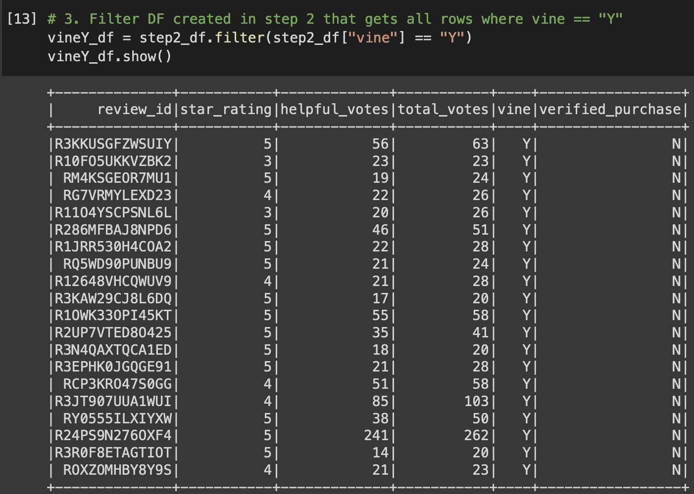
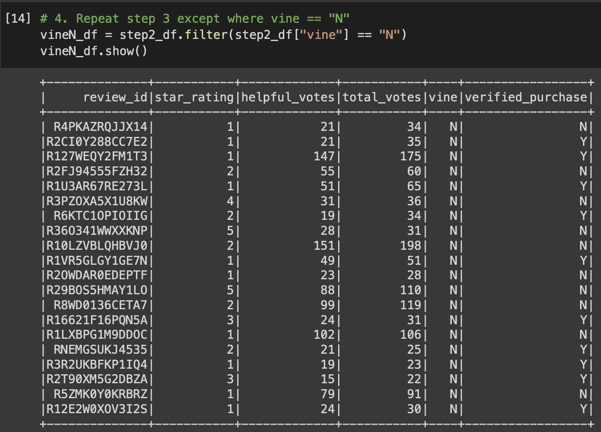
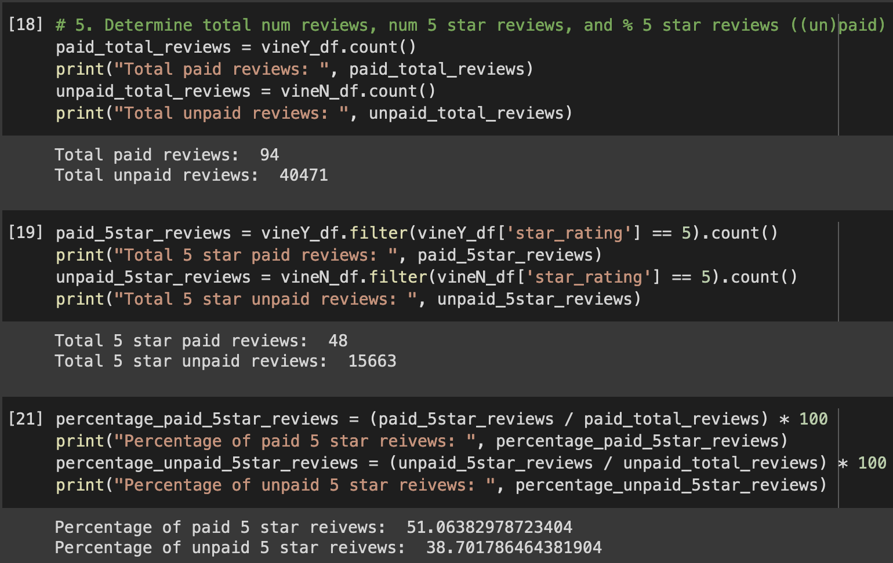

# Amazon Paid Review Analysis

## Analysis Overview

An analysis of the Amazon Vine program will be performed. An Amazon product dataset will need to be extracted, transformed, and loaded. Once complete, the transformed data will be analyzed for any bias toward favorable reviews from Vine members.

## Results

1. How many Vine reviews and non-Vine reviews were there?
  - The total Vine reviews were just 94 versus 40471 non-Vine reviews.
2. How many Vine reviews were 5 stars? How many non-Vine reviews were 5 stars?
  - There were 48 5-star Vine reviews and 15,663 5-star non-Vine reviews.
3. What percentage of Vine reviews were 5 stars? What percentage of non-Vine reviews were 5 stars?
  - The percentage of 5-star Vine reviews was 51.06% and the percentage of 5-star non-Vine reviews was 38.10%.

 
 
 

## Summary
One can see that the percentage of 5-star reviews is higher for Vine reviews than non-Vine reviews, supported by the images provided above. One additional analysis that could be performed is to filter the non-Vine reviews by verified purchases. On Amazon, anyone can create a review regardless if they've actually bought the item. Making sure the reviews are from verified purchasers may lead to new insights.
